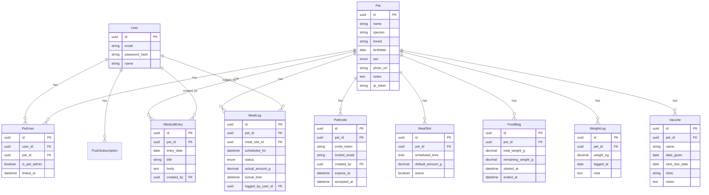

# 🐾 Pet Tracker

A modern Progressive Web App (PWA) designed for pet owners, roommates, families, and caretakers to collaboratively log and track the daily care of their pets. No more guessing if the dog was fed, double-feeding the cat, or running out of kibble unexpectedly.

The signature feature of Pet Tracker is a **printable QR code** that lives next to the pet's food bag. Scanning the QR code takes you directly to the log screen, pre-selected with the correct pet and meal slot, allowing you to record feedings in just two taps.

---

## ✨ Key Features

- 📱 **PWA & Mobile-First Design**: Optimized for mobile browsers, with a manifest ready for installation on home screens or wrapping in a native shell (via Turbo Native).
- 🏷️ **Printable QR Codes**: Generate, download, and print unique QR codes for each pet to enable instant logging.
- 🕒 **Meal Scheduling & Logging**:
  - Pre-configure multiple meal slots per pet (e.g., breakfast, lunch, dinner) with "weigh-once" default amounts.
  - Quick confirmation that uses the default weights to avoid typing/weighing every time.
  - **Duplicate Protection**: Warns caretakers if a meal has already been logged.
- 🔔 **Missed Meal Alerts**: Checks for missed feedings past a 60-minute grace window and triggers notifications.
- 🔄 **Catch-Up Flow**: Prompts users to resolve older, unlogged meal slots (e.g., "Fed (forgot to log)" or "Skipped") to keep history clean.
- 📦 **Food Inventory Tracking**:
  - Record new food bags with their starting weights.
  - Auto-decrements bag inventory as meals are logged.
  - Calculates daily average consumption and estimates remaining days of food.
  - Alerts you when food runs below a low-stock threshold.
- ⚖️ **Weight Logs & Trends**: Record weight entries and visualize trends over time.
- 💉 **Vaccine & Medical History**:
  - Track vaccine names, dates given, and upcoming due dates.
  - Keep a chronological, freeform journal of medical entries.

---

## 🛠️ Tech Stack

Pet Tracker is built as a robust, modern Ruby on Rails monolith:
- **Language & Framework**: **Ruby 3.4.10** and **Rails 8.1+**
- **Frontend Architecture**: **Hotwire** (Turbo + Stimulus) for seamless, fast UI updates without a separate SPA frontend.
- **Database**: **SQLite** (standard for modern lightweight production Rails 8 stacks)
- **Background Jobs**: **Solid Queue** (Rails 8's built-in database-backed queue system)
- **Caching & Cabs**: **Solid Cache** and **Solid Cable**
- **Image Storage**: **Active Storage** (for pet avatars/photos)
- **PWA Capabilities**: Service worker + Manifest (generated by Rails PWA configuration)
- **Containerization**: Production-ready **Dockerfile** with **Kamal** integration

---

## 🚀 Getting Started

### Prerequisites

Make sure you have the following installed on your machine:
- **Ruby** (v3.4.10)
- **SQLite3**
- **Bundler**

### Development Setup

1. **Clone the repository**:
   ```bash
   git clone https://github.com/V-Castro-Alves/pet-tracker.git
   cd pet-tracker
   ```

2. **Run the setup script**:
   We provide a helper script to automate gem installation and database preparation:
   ```bash
   bin/setup
   ```
   This script will install standard Gems, run migrations, prepare the database, and launch the development server.

3. **Start the background workers**:
   To run background jobs (such as meal grace-period checkers, vaccine due alerts, and low-stock alerts) locally, start **Solid Queue**:
   ```bash
   bin/jobs
   ```

4. **Access the application**:
   Open your browser and navigate to `http://localhost:3000`.

---

## 🧪 Testing

To run the test suite (models, controllers, integration, and system tests):
```bash
bin/rails test
```

For static style checking and security scanning:
```bash
bin/rubocop
bin/brakeman
```

---

## 🗄️ Data Model

The application uses a schema designed for multi-user collaboration around shared pet profiles:



---

## 🔒 Security & Access Control

- **QR Security**: The QR code encodes a unique, non-guessable `qr_token` targeting `/meal_log/{qr_token}`. It is **not** a bypass of authentication. Any person scanning the code must have a valid session and be linked to the pet via `PetUser` to access and submit logs.
- **Admin Roles**: The creator of a Pet profile takes the administrator role and has exclusive rights to invite or remove linked users, delete the pet profile, or regenerate the QR token.
- **Token Regeneration**: If a QR code is lost, damaged, or compromised, administrators can regenerate the `qr_token`, immediately invalidating the old printout.

---

## 📄 Specs and Documentation

For deeper details, consult the specification documents included in the project:
- 📖 [Product Spec](pet-tracker-spec.md)
- 🖥️ [Functional Spec](pet-tracker-functional-spec.md)
- ⚙️ [Technical Spec](pet-tracker-technical-spec.md)
